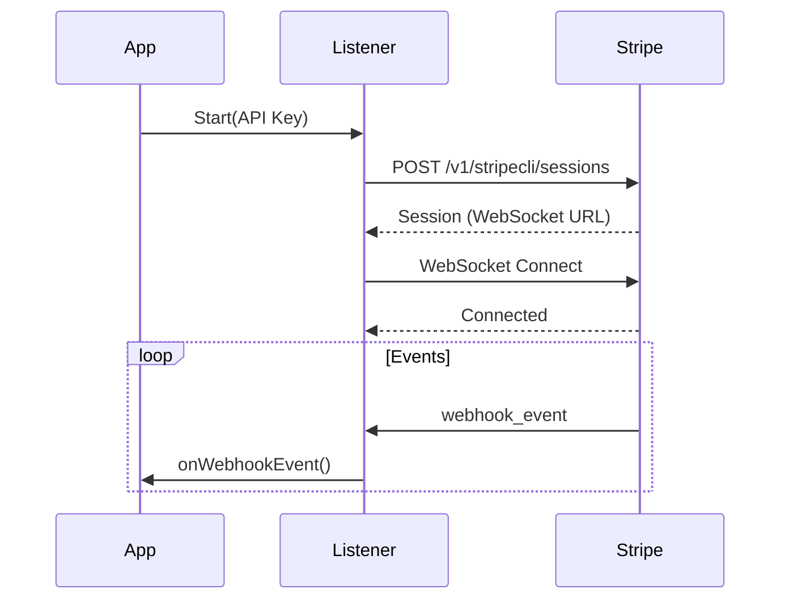

# stripelistener
# How it works

`stripelistener` allows your application to receive Stripe webhook events directly via WebSocket, mimicking the behavior of the Stripe CLI. This eliminates the need to expose a public endpoint (like ngrok) during development.

1.  **Authorize**: The listener authenticates with Stripe as a "device" to get a session.
2.  **Connect**: It establishes a WebSocket connection to Stripe's real-time events infrastructure.
3.  **Listen**: It streams `webhook_event` and `v2_event` messages and dispatches them to your registered handler.

## Stargazers

